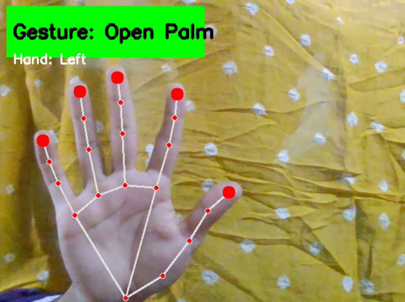
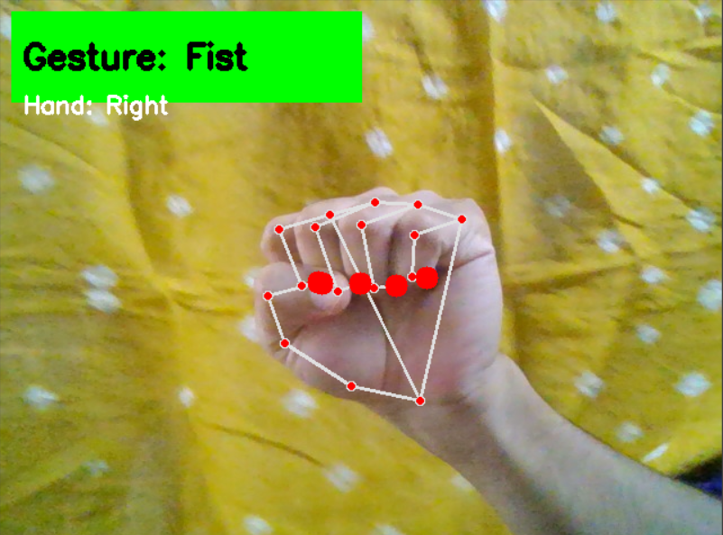
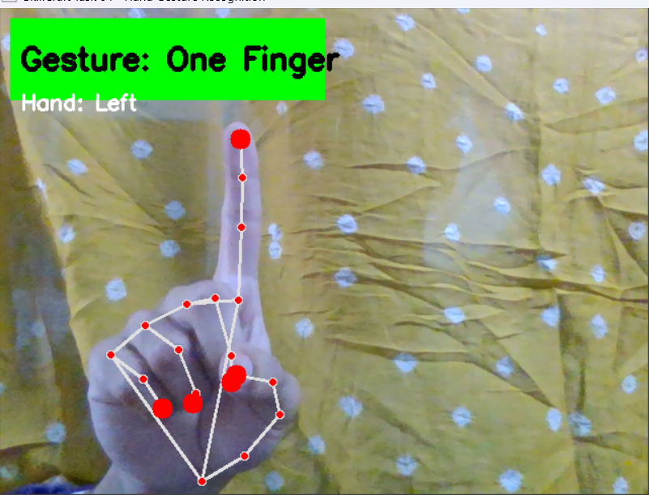
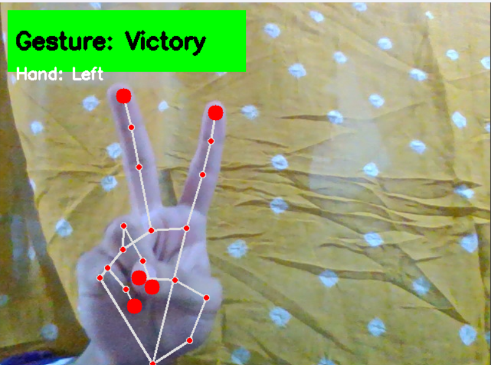
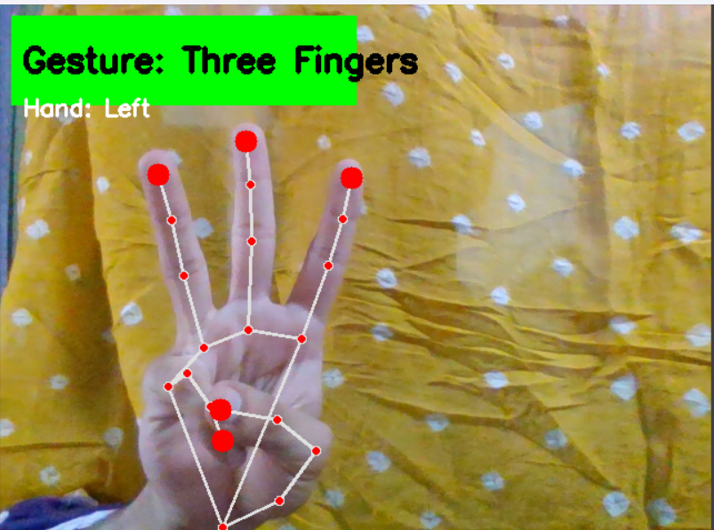
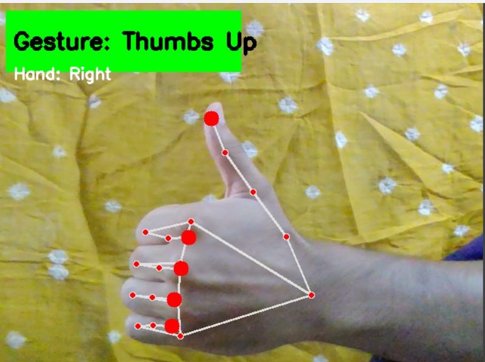

<div align="center">

# 🖐️ Hand Gesture Recognition using OpenCV & MediaPipe

### SkillCraft Technology – Machine Learning Internship | Task 04

<p align="center">
  
  
  
  
</p>

**A real-time hand gesture recognition system that detects hand landmarks and classifies common hand gestures using OpenCV and Google's MediaPipe framework.**

</div>

---

# 📖 Overview

This project was developed as part of the **Machine Learning Internship at SkillCraft Technology**.

The application captures live video from a webcam, detects human hands in real time, identifies **21 hand landmarks**, and classifies predefined gestures based on finger positions. It demonstrates how computer vision can be used to build intuitive **gesture-based human-computer interaction systems**.

---

# 🚀 Features

- 🎥 Real-time webcam capture
- ✋ Detects up to two hands simultaneously
- 📍 Tracks all 21 MediaPipe hand landmarks
- 🔴 Highlights fingertips
- 🧠 Recognizes predefined hand gestures
- 🤚 Detects Left and Right hands
- ⚡ Fast and lightweight real-time performance

---

# ✨ Supported Gestures

| Gesture | Description |
|----------|-------------|
| ✊ Fist | All fingers folded |
| ✋ Open Palm | All fingers extended |
| ☝ One Finger | Index finger raised |
| ✌ Victory | Index and middle fingers raised |
| 🤟 Three Fingers | Three fingers raised |
| 👍 Thumbs Up | Thumb extended upward |

---

# 🛠️ Technologies Used

| Technology | Purpose |
|------------|---------|
| Python | Programming Language |
| OpenCV | Image Processing & Webcam Access |
| MediaPipe | Hand Landmark Detection |
| NumPy | Numerical Operations |

---

# 📂 Project Structure

```text
SCT_ML_04_Hand_Gesture_Recognition/
│
├── hand_gesture_recognition.py
├── requirements.txt
├── README.md
├── LICENSE
├── .gitignore
│
├── screenshots/
│   ├── open_palm.png
│   ├── fist.png
│   ├── one_finger.png
│   ├── victory.png
│   ├── three_fingers.png
│   └── thumbs_up.png
│
└── demo.mp4
```

---

# ⚙️ Installation

## Clone the Repository

```bash
git clone https://github.com/YOUR_USERNAME/SCT_ML_04_Hand_Gesture_Recognition.git
```

## Navigate to the Project

```bash
cd SCT_ML_04_Hand_Gesture_Recognition
```

## Install Dependencies

```bash
pip install -r requirements.txt
```

## Run the Project

```bash
python hand_gesture_recognition.py
```

---

# 📸 Results

## Gesture Recognition Examples

| Open Palm | Fist |
|------------|------|
|  |  |

| One Finger | Victory |
|------------|----------|
|  |  |

| Three Fingers | Thumbs Up |
|---------------|-----------|
|  |  |

---

# 🧠 How It Works

1. Captures live webcam frames using OpenCV.
2. Converts frames from BGR to RGB.
3. Uses MediaPipe Hands to detect hand landmarks.
4. Extracts the coordinates of all 21 landmarks.
5. Determines whether each finger is open or folded.
6. Applies rule-based gesture classification.
7. Displays the recognized gesture on the video feed in real time.

---

# 🎯 Learning Outcomes

Through this project, I gained hands-on experience with:

- Computer Vision
- Real-Time Video Processing
- MediaPipe Hand Tracking
- Hand Landmark Detection
- Gesture Recognition
- Human-Computer Interaction
- OpenCV Image Processing
- Python for AI Applications

---

# 📌 Internship Details

**Company:** SkillCraft Technology

**Internship Domain:** Machine Learning

**Task:** Task 04 – Hand Gesture Recognition

**Project Type:** Computer Vision

---

# 🔮 Future Improvements

- 🤖 Train a machine learning classifier for custom gestures.
- 🖐️ Recognize dynamic hand gestures.
- 📊 Display gesture confidence scores.
- 🧾 Add gesture logging.
- 🎮 Integrate gesture control for presentations, games, or media players.

---

# 👨‍💻 Author

**Dev Karan Singh**

Machine Learning Intern

GitHub: **https://github.com/devkaranofficial**

LinkedIn: **www.linkedin.com/in/dev-karan-singh-979006413**

---

<div align="center">

### ⭐ If you found this project useful, consider giving it a star!

Made with ❤️ using Python, OpenCV, and MediaPipe.

</div>
